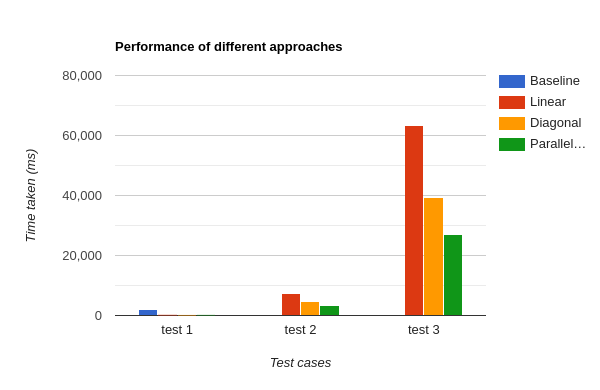

# Software Programming for Performance

## Topic: Smith Waterman with Backtracking

### Teammates:

- Prerak Srivastava (2020111013)

- Abhijnan Vegi (2020101004)

## Introduction

The Smith-Waterman algorithm is an algorithm that performs **local sequence alignment**, which means that the it finds the region with **highest similarity** between two sequences. These sequences can be nucleic acid sequences or protein sequences.

### Local Alignment Problem

The local alignment problem states that given two strings $S_1$ and $S_2$ , we are required to find substrings $\alpha$ from $S_1$ and $\beta$ from $S_2$ whose optimal global alignment value is maximum over all pairs of substrings from $S_1$ and $S_2$. 

### Substitution Matrix

A substitution matrix is a collection of scores for aligning characters of a sequence with one another. These scores generally represent the level of similarity between the characters and the context depends on the sequences that are being compared. 

For example, the for aligning a nucleic acid sequence or a protein sequence, the scores represent the relative ease with which one nucleotide or amino acid may mutate into or substitute for another.

### Gap Penalty

When aligning sequences, sometimes introducing gaps in the sequences can allow an alignment algorithm to match more terms than a gap-less alignment **((((((could add example here))))))**. However, it should still be a priority for the algorithm to minimize the number of gaps in an alignment as too many gaps can cause an alignment to be meaningless. In implementation, a penalty is added to the scoring system when aligning 2 characters based on the characters that are present in the neighborhood and their scores in the substitution matrix.  

### Algorithm

#### Initialization and Notation

Let the two sequences be $\alpha$ and $\beta$ of sizes $m$ and $n$ respectively. The DP matrix that will be used will be of size $(m+1)*(n+1)$.

Let $F(i,j)$ represent the value of the cell in the $i^{th}$ row and $j^{th}$ column in the DP matrix.

Let $s(i,j)$ represent the value of the cell in the $i^{th}$ row and $j^{th}$ column in the substitution matrix, which represents the similarity score of the $i^{th}$ character from $\alpha$ and the $j^{th}$ character from $\beta$. 

Let $d$ represent the gap penalty that is being used for the algorithm.

The scoring system and the gap penalty for our implementation is as follows:
- **Scoring System**: +3 if match, -3 if mismatch
- **Gap Penalty**: 2

The initialization of the DP matrix is as follows

- $F(i,0) = 0  \ \forall \ 0 \leq i \leq m$
- $F(0,j) = 0  \ \forall \ 0 \leq j \leq n$

#### Filling the DP matrix

The filling up of the DP matrix is done by using the following equation
$$
F(i,j) = \text{max}
     \begin{cases}
       0 \\ 
       F(i-1,j-1) + s(i,j)\\
       F(i-1,j) - d \\
       F(i,j-1) - d\\
     \end{cases}
$$
In the following function,

- $0$ represents that there is no similarity between $\alpha_i$ and $\beta_j$ 
- $F(i-1,j-1)$ represents the similarity score of aligning $\alpha_i$ and $\beta_j$ 
- $F(i-1,j) -d$ represents that $\alpha_i$ is aligned with a gap
- $F(i,j-1) -d$ represents that $\beta_i$ is aligned with a gap

For ever cell of the DP matrix, we add a pointer which points to the cell which was the source for this cell. This pointer is later used for backtracking. 

**Time Complexity**: $O(mn)$  
**Space Complexity**: $O(mn)$

#### Backtracking

The process of backtracking is as follows:

- Finding the highest score in the DP matrix
- Following the pointers that were added to each cell in the previous step, starting from the cell with the highest score and these pointers are followed until a 0 is encountered. 
- Simultaneously, the characters that are matched in the subsequence are written down one below the other, and if a gap is encountered in either of the sequences (depending on the source of the score in that cell), it represented by a dash "-". 

This gives us the subsequence with the highest similarity score based on the similarity system dictated by the substitution matrix and the gap penalty that is used.

## Baseline Case

### Method
- The DP matrix is filled in a row major fashion and stored (each row is calculated completely before moving on to the next row)
- `maxScore` keeps a track of the position of the highest score in the matrix and is checked in every cell's calculation.
- The traceback starts from the cell with the highest score and traces back until a 0 is encountered.

### Benchmarking

All execution times are given in ms.

1. No flags

| Test Type | Test Name | Execution Time |
| --------- | --------- | -------------- |
| small     | test_1    | 2084.279       |
| small     | test_2    | Segfault       |
| small     | test_3    | Segfault       |
| small     | test_4    | Segfault       |

2. **Flags**: `-Wall -g -O2 -std=c99 -march=native -mtune=native`

| Test Type | Test Name | Execution Time |
| --------- | --------- | -------------- |
| small     | test_1    | 1312.946       |
| small     | test_2    | Segfault       |
| small     | test_3    | Segfault       |
| small     | test_4    | Segfault       |

## Shortcomings of Baseline and Scope for Optimization

- **No parallelization**: Not using multiple cores of your CPU or any SIMD instructions to optimize the execution of the code.
- **Many cache misses**: In the current approach, we are filling in the matrix row major fashion, so for filling in each row, the elements in the current row and the previous row are accessed in the recursive function, which would lead to multiple cache misses, even more so if the row doesn't fit into cache, then each row will get cleared from cache once its computed.
- **Tracebacking Problem**: Consider the case where the sequences are of size 1MB each ($10^6$ bytes), this implies that the DP matrix we need to calculate the traceback would be of size 1TB, which is an absurd amount of data that is required to be stored. Since each character from the final alignment is dependent on the current row and the previous row, the scope for optimizing the backtracking becomes extremely small as we are required to store all the rows of the matrix in order to not lose any characters from the final alignment.

## Optimization
## 1. Linear Approach

### Method
- The DP matrix is filled in a row major fashion and not stored (each row is calculated completely before moving on to the next row). Each row is stored in the `top` and `curr` variable, which is replaced while computing the next row.
- `maxScore` keeps a track of the highest score in the matrix and is checked in every cell's calculation.

### Benchmarking

1. No flags

| Test Type | Test Name | Execution Time |
| --------- | --------- | -------------- |
| small     | test_1    | 892.903        |
| small     | test_2    | 28893.43       |
| small     | test_3    | 239601.98      |
| small     | test_4    | > 300000       |

2. **Flags**: `-Wall -g -O2 -std=c99 -march=native -mtune=native`

| Test Type | Test Name | Execution Time |
| --------- | --------- | -------------- |
| small     | test_1    | 251.541 |
| small     | test_2    | 7497.219 |
| small     | test_3    | 63481.341 |
| small     | test_4    |  > 100000  |

Theoretically approximating by scaling, `test_4` will approximately take 2500 minutes to execute.

### Speedup
Speedup : $8\times$

## 2. Diagonal Computation Approach

### Method

- Since the DP function requires the value of every $(i,j)$ cell to be dependent on the $(i-1,j), (i,j-1),(i-1,j-1)$ cells, we can see that there is scope for computation along the **diagonal** as shown below:

  Let us take the example where we have to align 2 sequences of size 4 each.

  

  Here, the number in each cell (other than the 0s) represent the order in which their value will be computed. The colors show the diagonals along which the computation is done.

- `maxScore` keeps a track of the maximum score in the matrix.

### Benchmarking

1. No flags

   | Test Type | Test Name | Execution Time |
   | --------- | --------- | -------------- |
   | small     | test_1    | 932.299        |
   | small     | test_2    | 29521.036      |
   | small     | test_3    | 245205.252     |
   | small     | test_4    | > 300000       |

2. **Flags**: `-Wall -g -O2 -std=c99 -march=native -mtune=native`

| Test Type | Test Name | Execution Time |
| --------- | --------- | -------------- |
| small     | test_1    | 142.881        |
| small     | test_2    | 4623.872       |
| small     | test_3    | 39466.589      |
| small     | test_4    | > 100000       |

As we can see, the benchmarking results for the diagonal computation approach is quite similar to the baseline case results, this is because we are essentially performing the same number of computations in both methods, which in turn produces the same results. **The upside** with the diagonal computation approach is that there is scope of **parallelization** along the diagonals, which can significantly reduce the execution times.

### Speedup
Speedup : $14.67\times$

## 3. Parallelized Diagonal Computation Approach

### Method

- The method is the same as the diagonal computation approach, but every cell in a diagonal is computed parallelly.
- A thread is spawned for each cell in the diagonal which performs the computation
- In the initial diagonals, the work done by each threads is less. As the length of the diagonals get bigger and bigger, the amount of work by each thread increases. 

### Benchmarking

**Flags**: `-Wall -g -O2 -std=c99 -march=native -mtune=native -fopenmp` 

| Test Type | Test Name | Execution Time |
| --------- | --------- | -------------- |
| small     | test_1    | 185.368        |
| small     | test_2    | 3210.834       |
| small     | test_3    | 27087.926      |
| small     | test_4    | > 100000       |

### Speedup
Speedup : $21.37\times$

## Performance Comparision

